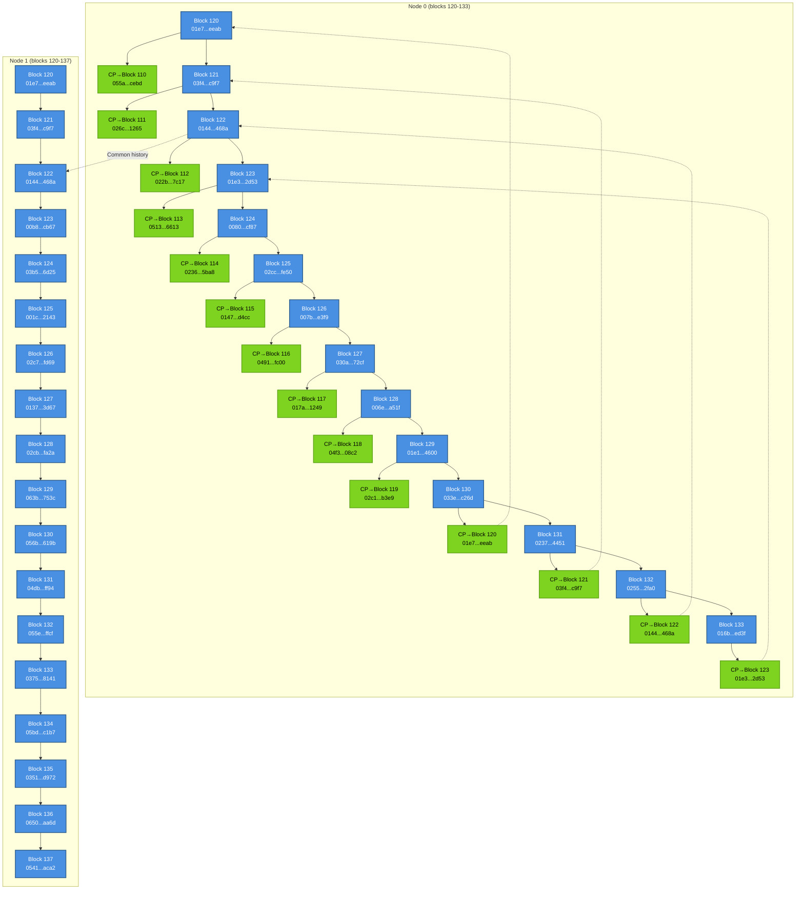

# Checkpoints Tests

This directory contains tests for verifying automatic checkpoint functionality in KomodoOcean.

## Requirements

- Python 3.6 or higher
- Python virtual environment (recommended)

## Installation

### 1. Create Virtual Environment

```bash
cd /media/decker/data1tb/auto-checkpoints/KomodoOcean/qa/checkpoints-tests
python3 -m venv venv
```

### 2. Activate Virtual Environment

**Linux/macOS:**
```bash
source venv/bin/activate
```

**Windows:**
```bash
venv\Scripts\activate
```

### 3. Install Dependencies

```bash
pip install --upgrade pip
pip install -r requirements.txt
```

## Running Tests

After activating the virtual environment and installing dependencies, you can run the tests:

```bash
python3 ./try-fork-before-checkpoint.py
```

## Quick Setup (One Command)

You can use the `setup_venv.sh` script for automatic setup:

```bash
bash ./setup_venv.sh
```

This will create the virtual environment, install dependencies, and activate it.

## Deactivating Virtual Environment

When you're done working, deactivate the virtual environment:

```bash
deactivate
```

## Dependencies

- `simplejson` - JSON library (faster alternative to the standard json module)

## Notes

- Make sure you are in the `qa/checkpoints-tests` directory before running tests
- The virtual environment is created locally in the `venv/` directory and should not be added to version control

## Block diagram


